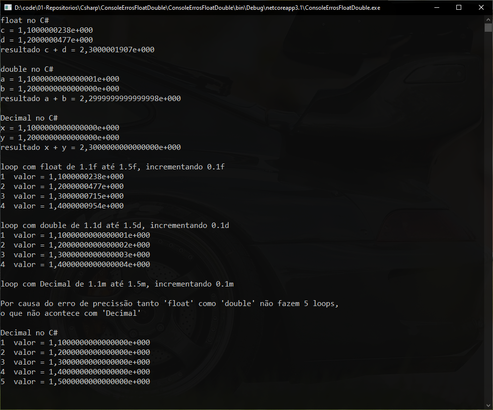

# Console Erros flat e double


***```Programa GNU GPL```*** que exemplifica as diferenças de falta de presição em ***float*** e ***double***; e como estas não aparecem em ***Decimal***.  


Tela de resultados no console.


